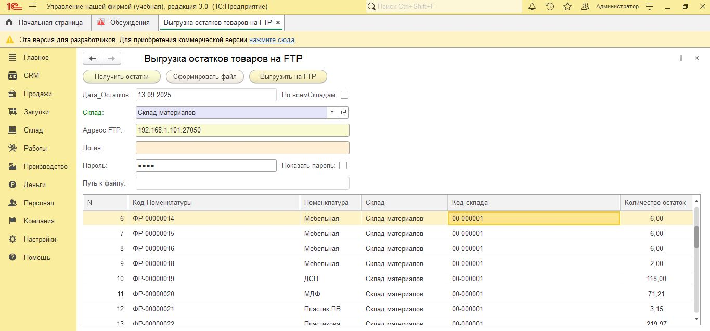

Обработка для 1С 8.3 для выгрузки остатков товаров в XML файл и загрузки на FTP сервер(УНФ_3.0).

 Возможности

-  Получение остатков товаров по складу или по всем складам
- Формирование XML файла с остатками
- Выгрузка файла на FTP сервер
- Автоматическое именование файлов с датой и временем
- Проверки корректности данных

 Технологии

- 1С:Предприятие 8.3
- XML
- FTP протокол
- Запросы к регистрам накопления

Установка

1. Клонируйте репозиторий:

Загрузите обработку в 1С через меню "Файл" → "Открыть"

Использование
Заполните параметры FTP подключения

Выберите склад или отметьте "По всем складам"

Нажмите "Получить остатки"

Для разработки используйте:

1С:Предприятие 8.3.20+

Протестированно УНФ 3.0(ДЕМО)

Нажмите "Сформировать файл" для создания XML

Нажмите "Выгрузить на FTP" для отправки файла
